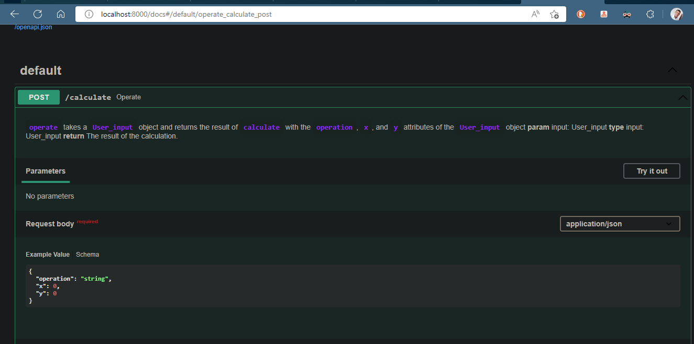
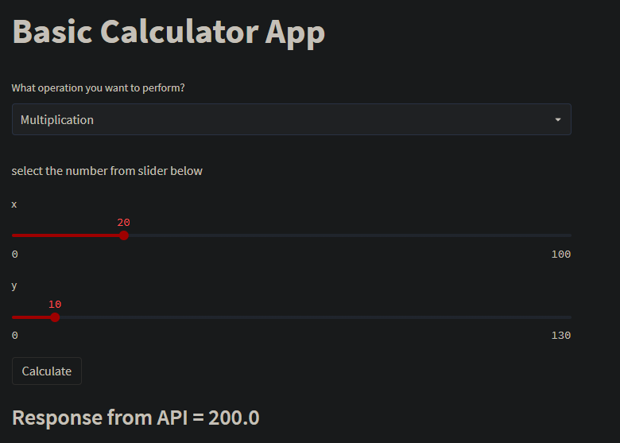

# Streamlit🔥+ FastAPI⚡️
[Streamlit](https://streamlit.io/) is an open-source, free, all-python framework to rapidly build and share interactive dashboards and web apps for Data Science / Machine Learning Projects. 🚀
1. Create a basic Python Calculator module.
2. Serve the function from the module using FastAPI.
3. Creating a very basic UI using Streamlit.
4. Integrating Streamlit & FastAPI.


### Prerequisites  📋
```
ubuntu o wsl
```

### installation 🔧
In the terminal located in the folder where you want to save this project, execute the following.
```
git clone https://github.com/Dimaps716/calculate_dev
```
move to developer branch.
```
git checkout developer
```
### run project dependencies.
_create a virtual environment in my case I use the python one_

```
python3 -m venv env
```
_install dependencies requirements.txt_
```
pip3 install -r requirements.txt
```
_start the local server_
```
uvicorn main:app  --reload
```
* We can now open the Swagger UI here 👉 http://127.0.0.1:8000/docs


### Create the web app using Streamlit 🔥
For creating the UI we’ll use Streamlit, it’s an application framework that makes it easy for data scientists and machine learning engineers to create data scripts into shareable web apps in minutes. All in pure Python. No front‑end experience is required ✨

```
file path  stream/stream_lit.py
```
* In the above app I have used the following components:

1. st.title: Display text in title formatting.
2. st.write: Write arguments to the app.
3. st.selectbox: Display a select widget.
4. st.slider: Display a slider widget.
5. st.button: Display a button widget.

_For running the streamlit server we need to run the following command_
```
 streamlit run .\stream\stream_lit.py
```

_It will launch the app in the browser, you can go to http://localhost:8501 The web app will look something like this 👇_

## Built with 🛠️
* [Python](https://www.python.org/)
* [Streamlit](https://streamlit.io/)
* [FastAPI](https://fastapi.tiangolo.com/)
* 

## Authors ✒️
* ** Dimanso perez ** - * Initial Work * - [Dimaps716](https://github.com/Dimaps716)


## License 📄
This project is under the License (Your License) - see the  (LICENSE.md) file for details

## Expressions of Gratitude 🎁
* Tell others about this project 📢
* Invite a beer 🍺 or a coffee ☕ to someone on the team.
* Give thanks publicly 🤓.

---
⌨️ with ❤ by [Dimaps716](https://github.com/Dimaps716) 😊